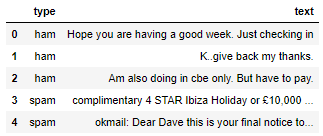

# ClassSpam_NaiveBayes

## Tópicos 

[Descrição](#Descrição)

[Dados](#Dados)

[Estrutura do Diretório](#Estrutura-do-Diretório)

[Ferramentas utilizadas](#Ferramentas-utilizadas)


## Descrição

Exemplo de uso do algoritmo Naive Bayes aplicado para classificação de spam de uma base de sms.

Lab apresentado no curso Machine Learning para cientista de dados da Data Science Academy (DSA)

## Dados

CSV obtido no curso.

shape: (5559, 2)

coluna 1: Type (ham or spam)
coluna 2: text (sms para classificação)

#

## Estrutura do Diretório
```
│   ClassSpam_NaiveBayes.ipynb
│   ClassSpam_NaiveBayes.py
│   sms_spam.csv
│   spam_model.pkl
│   print_csv.png
│   README.md
│
```
## Ferramentas utilizadas
* Jupyter notebook
* Python